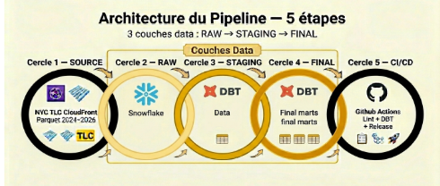
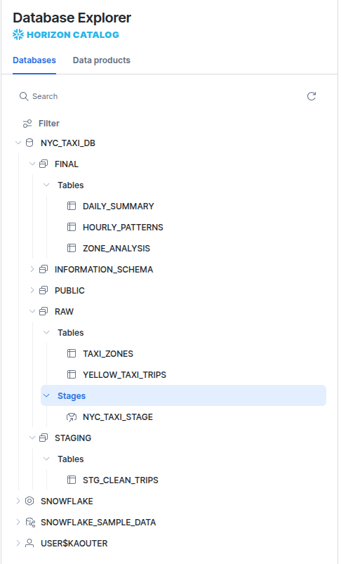
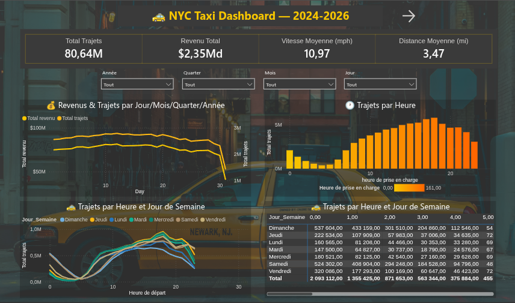
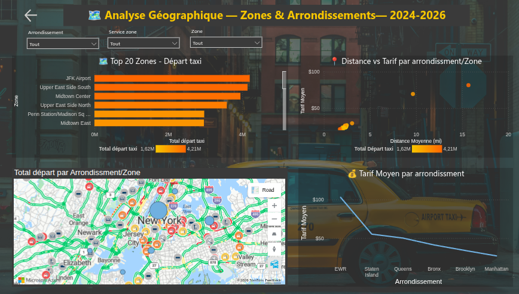

# NYC Taxi Pipeline — MarvelousSamurai

> Pipeline de données complet pour l'analyse des trajets de taxis jaunes à New York City.
> Référence projet : dataset consolidé **2024-2026**.
> Réalisé dans le cadre du programme **Simplon Data Engineering P1-2025** en 3 jours.

---

## Table des matières

1. [Contexte et objectifs](#1-contexte-et-objectifs)
2. [Équipe MarvelousSamurai](#2-équipe-marvelousSamurai)
3. [Architecture globale](#3-architecture-globale)
4. [Stack techniques](#4-stack-techniques)
5. [Gestion de projet GitHub](#5-gestion-de-projet-github)
6. [Architecture Snowflake](#6-architecture-snowflake)
7. [Méthodes d'ingestion](#7-méthodes-dingestion)
8. [Transformation STAGING](#8-transformation-staging)
9. [Transformation FINAL](#9-transformation-final)
10. [Transformations dbt](#10-transformations-dbt)
11. [CI/CD GitHub Actions](#11-cicd-github-actions)
12. [Dashboard Streamlit & Power BI](#12-dashboard-streamlit--power-bi)
13. [Résultats clés](#13-résultats-clés)
14. [Installation et démarrage](#14-installation-et-démarrage)
15. [Structure du projet](#15-structure-du-projet)
16. [Résumé SQL utilisé (équipe)](#16-résumé-sql-utilisé-équipe)
17. [Licence](#17-licence)

---

## 1. Contexte et objectifs

### Contexte

Les taxis jaunes de New York City génèrent des millions de trajets chaque mois. La **TLC (Taxi & Limousine Commission)** publie ces données en open data au format Parquet. Ce projet construit un pipeline de bout en bout pour ingérer, nettoyer, transformer et visualiser ces données à l'échelle.

### Objectifs pédagogiques

| Objectif | Technologie |
|---|---|
| Ingestion batch à grande échelle | Python, Snowflake Connector, Snowpark |
| Entrepôt de données en couches (medallion) | Snowflake (RAW / STAGING / FINAL) |
| Transformation déclarative avec tests | dbt Core |
| Automatisation et qualité de code | GitHub Actions, flake8, sqlfluff |
| Visualisation interactive | Streamlit, Power BI |
| Gestion de projet agile | GitHub Issues, Milestones, Kanban |

### Périmètre des données

- **Source :** NYC TLC Yellow Taxi Trip Records
- **Période de référence projet :** 2024 → 2026
- **Fichiers Parquet ingérés :** 28
- **Volume brut total (RAW) :** 104 770 192 trajets
- **Volume nettoyé (STAGING) :** 80 971 653 trajets
- **Taux de rétention :** 77,29%

> Note : certains membres ont chargé une plage différente selon leur compte Snowflake Trial ; la documentation prend **uniquement 2024-2026** comme référence.

---

## 2. Équipe MarvelousSamurai

| Membre | Rôle |
|---|---|
| **Kaouter RHAZLANI** | Data Engineer |
| **Yohan** | Data Engineer |
| **Dahani** | Data Engineer |

Les trois membres ont contribué à l'ensemble des étapes du projet : ingestion des données brutes, nettoyage et staging, transformations dbt, et visualisation du dashboard.

**Programme :** Simplon Data Engineering P1-2025

**Durée du sprint :** 3 jours

**Kanban projet :** https://github.com/orgs/Simplon-DE-P1-2025/projects/33

**Repo Simplon :** [Simplon-DE-P1-2025/nyc-taxi-pipeline-MarvelousSamurai](https://github.com/Simplon-DE-P1-2025/nyc-taxi-pipeline-MarvelousSamurai)

---

## 3. Architecture globale

```
┌─────────────────────────────────────────────────────────────────────────┐
│                         NYC TLC Open Data                               │
│              (Parquet files — d37ci6vzurychx.cloudfront.net)            │
└──────────────────────────────┬──────────────────────────────────────────┘
                               │
                    ┌──────────▼──────────┐
                    │  Python Ingestion   │
                    │ load_raw.py (M1)    │
                    │ load_copy.py (M2)   │
                    │ load_zones.py (M3)  │
                    └──────────┬──────────┘
                               │
┌──────────────────────────────▼──────────────────────────────────────────┐
│                         SNOWFLAKE — NYC_TAXI_DB                         │
│                                                                         │
│  ┌─────────────┐    ┌──────────────────┐    ┌────────────────────────┐  │
│  │  RAW Schema │    │  STAGING Schema  │    │     FINAL Schema       │  │
│  │             │    │                  │    │                        │  │
│  │ YELLOW_TAXI │───▶│  stg_clean_trips │───▶│   daily_summary        │  │
│  │   _TRIPS    │    │  (dbt model)     │    │   zone_analysis        │  │
│  │             │    │                  │    │   hourly_patterns      │  │
│  │ TAXI_ZONES  │───▶│                  │    │                        │  │
│  └─────────────┘    └──────────────────┘    └────────────────────────┘  │
└──────────────────────────────┬──────────────────────────────────────────┘
                               │
                    ┌──────────▼──────────┐
                    │ Streamlit /Power BI │
                    │     Dashboards      │
                    └─────────────────────┘
```

---

## 4. Stack techniques

| Couche | Technologie | Définition / fonctionnement |
|---|---|---|
| Stockage & Compute | Snowflake (X-Small, auto-suspend 60s) | Plateforme cloud data warehouse qui sépare stockage et calcul. `NYC_TAXI_DB` = base de données (schémas RAW, STAGING, FINAL). `NYC_TAXI_WH` = warehouse (moteur de calcul virtuel). |
| Ingestion | Python 3.11, snowflake-connector, Snowpark | `snowflake-connector` = driver Python officiel. Snowpark = API DataFrame de Snowflake. Utilisés dans `load_raw.py`, `load_copy.py`, `load_taxi_zones.py`. |
| Transformation | dbt Core + dbt-snowflake | Framework ELT SQL qui versionne les transformations et les tests. Construit stg_clean_trips → daily_summary, zone_analysis, hourly_patterns. |
| Orchestration | GitHub Actions | Lint automatique, release GitHub sur main, chaîne dbt documentée en CI. |
| Qualité de code | flake8, sqlfluff | flake8 = linter Python. sqlfluff = linter SQL dialecte Snowflake. |
| Dashboard | Streamlit 1.40, Power BI | Streamlit : app data Python (dashboard/app.py). Power BI : tableaux de bord métier sur tables FINAL. |
| Versioning | Git, GitHub | Flux feature/* → dev → main avec PR et reviews obligatoires. |

---

## 5. Gestion de projet GitHub

### Milestones (9 jalons)

| # | Milestone | Description |
|---|---|---|
| 1 | **Setup** | Création du repo, environnements, Snowflake warehouse/database/schemas |
| 2 | **Ingestion** | Scripts Python pour charger les Parquet dans RAW |
| 3 | **Staging** | Nettoyage et standardisation dans STAGING |
| 4 | **DBT** | Modèles dbt staging + tests génériques |
| 5 | **Analytique** | Tables FINAL (daily_summary, zone_analysis, hourly_patterns) |
| 6 | **Orchestration** | Pipeline GitHub Actions (lint, dbt, release) |
| 7 | **Visualisation** | Dashboard Streamlit avec KPIs et graphiques |
| 8 | **Monitoring** | Analyse qualité des données, rapports CSV |
| 9 | **Documentation** | README, CONTRIBUTING, data-check.md |

### Stratégie de branches

```
main (protégée — CI/CD + release)
  └── dev (protégée — intégration)
        ├── feature/ingestion
        ├── feature/staging
        ├── feature/dbt
        ├── feature/orchestration
        └── feature/streamlit
```

**Règles :**
- Toute fonctionnalité passe par une branche `feature/`
- Merge via Pull Request avec review obligatoire
- Push sur `origin` (personnel) ET `upstream` (Simplon)

### Convention de commits

```
feat:     Nouvelle fonctionnalité
fix:      Correction de bug
chore:    Maintenance / dépendances
docs:     Documentation uniquement
test:     Ajout ou modification de tests
refactor: Refactoring sans changement fonctionnel
```

### Pull Requests notables

| PR | Branche | Description |
|---|---|---|
| #34 | `feature/snowflake-dual-auth` | Auth dual-mode keypair/password + zones TLC + enrichissement zone_analysis |
| #27 | `fix/passenger-count` | Correction filtre `passenger_count <= 5` (conformité TLC) |
| #29 | `feature/orchestration` | Ajout pipeline.yml GitHub Actions + commentaires CI |

---

## 6. Architecture Snowflake

Chaque membre a créé son propre compte **Snowflake Trial** (comptes séparés, $400 crédits, 30 jours).
Le setup SQL inclut aussi la création d'utilisateurs/rôles pour un éventuel compte partagé (objectif : réactiver le job dbt en CI — voir [section 11](#11-cicd-github-actions)).



### Setup complet Snowflake

```sql
USE ROLE ACCOUNTADMIN;

CREATE WAREHOUSE IF NOT EXISTS NYC_TAXI_WH
  WAREHOUSE_SIZE = 'X-SMALL'
  AUTO_SUSPEND = 60
  AUTO_RESUME = TRUE;

USE WAREHOUSE NYC_TAXI_WH;

CREATE DATABASE IF NOT EXISTS NYC_TAXI_DB;

CREATE SCHEMA IF NOT EXISTS NYC_TAXI_DB.RAW;
CREATE SCHEMA IF NOT EXISTS NYC_TAXI_DB.STAGING;
CREATE SCHEMA IF NOT EXISTS NYC_TAXI_DB.FINAL;

-- Users pour compte partagé
CREATE USER IF NOT EXISTS dahani
  PASSWORD = '<SECRET_PASSWORD>'
  DEFAULT_ROLE = ACCOUNTADMIN
  DEFAULT_WAREHOUSE = NYC_TAXI_WH
  DEFAULT_NAMESPACE = NYC_TAXI_DB.RAW;

CREATE USER IF NOT EXISTS yohan
  PASSWORD = '<SECRET_PASSWORD>'
  DEFAULT_ROLE = ACCOUNTADMIN
  DEFAULT_WAREHOUSE = NYC_TAXI_WH
  DEFAULT_NAMESPACE = NYC_TAXI_DB.RAW;

GRANT ROLE ACCOUNTADMIN TO USER dahani;
GRANT ROLE ACCOUNTADMIN TO USER yohan;
```

> Recommandation CI/CD : utiliser un utilisateur dédié `DBT_CI_USER` avec rôle minimal plutôt que `ACCOUNTADMIN`.

### Tables principales

| Schéma | Table | Description | Volume |
|---|---|---|---|
| RAW | `YELLOW_TAXI_TRIPS` | Données brutes TLC (toutes colonnes) | ~104,8M lignes |
| RAW | `TAXI_ZONES` | Référentiel géographique NYC (265 zones) | 265 lignes |
| STAGING | `stg_clean_trips` | Trajets nettoyés + colonnes enrichies | ~80,97M lignes |
| FINAL | `daily_summary` | Agrégations journalières (KPIs) | ~700 lignes |
| FINAL | `zone_analysis` | Statistiques par zone de pickup | ~263 lignes |
| FINAL | `hourly_patterns` | Patterns horaires et jour de semaine | ~168 lignes |

### Stage interne (Méthode 2)

```sql
CREATE FILE FORMAT ff_parquet TYPE = 'PARQUET';
CREATE STAGE NYC_STAGE FILE_FORMAT = ff_parquet;
```

### Colonnes RAW vs STAGING

| RAW (TLC original) | STAGING (standardisé) |
|---|---|
| `"VendorID"` | `vendor_id` |
| `"tpep_pickup_datetime"` (microsecondes epoch) | `pickup_datetime` (TIMESTAMP) |
| `"PULocationID"` | `pickup_location_id` |
| `"DOLocationID"` | `dropoff_location_id` |
| `"_source_file"` (technique) | `source_file` |
| *(absent)* | `trip_duration_min`, `avg_speed_mph`, `tip_rate` |
| *(absent)* | `distance_category`, `time_period` |

---

## 7. Méthodes d'ingestion

### Méthode 1 — `load_raw.py` (Pandas + write_pandas)

```
NYC TLC → AWS CloudFront → requests.get() → BytesIO → pandas → write_pandas() → RAW.YELLOW_TAXI_TRIPS
```

Les fichiers Parquet sont hébergés sur CloudFront par la TLC et téléchargés **directement en mémoire** — aucun fichier écrit sur disque :
- Trajets : `https://d37ci6vzurychx.cloudfront.net/trip-data/yellow_tripdata_2024-01.parquet`
- Zones : `https://d37ci6vzurychx.cloudfront.net/misc/taxi_zone_lookup.csv`

**Caractéristiques :**
- Téléchargement HTTP en mémoire (`requests.get()` → `BytesIO`)
- Génération dynamique des URLs par année/mois depuis `config.yaml`
- Gestion des 404 (fichiers non disponibles → ignorés)
- Détection et ajout automatique des nouvelles colonnes (`ALTER TABLE`)
- Option `truncate_before_ingestion` dans `config.yaml`
- Colonnes techniques ajoutées : `_source_file`, `_ingestion_date`

**Authentification Snowflake — module `snowflake_auth.py` (dual-mode) :**

| Priorité | Environnement | Méthode | Source |
|---|---|---|---|
| 1 | CI/CD GitHub Actions | Keypair JWT | `SNOWFLAKE_PRIVATE_KEY_B64` (Secret GitHub) |
| 2 | Dev local (keypair) | Keypair JWT | `~/.ssh/snowflake_key.p8` |
| 3 | Dev local (password) | Password | `SNOWFLAKE_PASSWORD` (.env) |

La configuration vient de l'environnement, jamais du code.

---

### Méthode 2 — `load_copy.py` (Stage + PUT + COPY INTO) — Recommandée

```
Parquet (HTTP) ──▶ /tmp/ ──▶ PUT → NYC_STAGE ──▶ COPY INTO RAW.YELLOW_TAXI_TRIPS
```

Pour chaque fichier : téléchargement HTTP → PUT dans stage Snowflake → COPY INTO table.

**Caractéristiques :**
- **Idempotente :** `PUT OVERWRITE=FALSE` — un fichier déjà chargé n'est pas rechargé
- Téléchargement en streaming via `tempfile.TemporaryDirectory`
- Création automatique du `FILE FORMAT`, du `STAGE` et de la table via `INFER_SCHEMA`
- Chargement `COPY INTO` avec `MATCH_BY_COLUMN_NAME = CASE_INSENSITIVE`
- Piloté par `ingestion/config_copy.yaml`

**Comparaison des méthodes :**

| Critère | Méthode 1 (write_pandas) | Méthode 2 (COPY INTO) |
|---|---|---|
| Performance | Moyenne (pandas en mémoire) | Haute (natif Snowflake) |
| Idempotence | Non (truncate) | Oui (OVERWRITE=FALSE) |
| Détection schéma | Pandas (approx.) | INFER_SCHEMA (précis) |
| Colonnes techniques | `_source_file`, `_ingestion_date` | `METADATA$FILENAME` possible |
| Cas d'usage | Dev / POC | Production / gros volumes |

---

### Méthode 3 — `load_zones.py` (Référentiel taxi zones)

```
taxi_zones.csv (TLC CloudFront) ──▶ pandas ──▶ Snowpark DataFrame ──▶ RAW.TAXI_ZONES
```

- Télécharge le CSV TLC, charge en pandas puis Snowpark DataFrame
- `session.create_dataframe(df)` → `save_as_table(mode="overwrite")`
- 265 zones : `LOCATION_ID`, `BOROUGH`, `ZONE`, `SERVICE_ZONE`
- Utilisé pour enrichir `zone_analysis` avec les noms de quartiers

---

## 8. Transformation STAGING

Après l'ingestion RAW, la table nettoyée est construite via le modèle dbt :
`dbt/nyc_taxi/models/staging/stg_clean_trips.sql`

### Conversion des timestamps TLC

Les timestamps bruts sont en **microsecondes epoch** dans le RAW :
```sql
TO_TIMESTAMP("tpep_pickup_datetime" / 1000000) AS pickup_datetime
```
Division par 1 000 000 → conversion microsecondes → secondes → TIMESTAMP.

### Anomalies détectées dans les données RAW

| Anomalie | Valeur observée | Impact généré | Lignes concernées |
|---|---|---|---|
| Distance aberrante | Max RAW : **398 608 miles** (≈ 1,7× distance Terre-Lune) | Vitesse calculée > 9 000 mph | 11 942 lignes |
| Vitesse aberrante résiduelle | Distance normale + durée < 1 min | `avg_speed_mph` > 100 mph | 4 902 lignes |
| Taux pourboire > 100% | `tip_amount > fare_amount` | `tip_rate` > 1 | 93 048 lignes |
| Passagers hors TLC | `passenger_count > 5` | Non conforme règlement TLC | ~334 799 lignes |
| Durée incohérente | `dropoff < pickup` ou durée > 300 min | Trajets impossibles | ~1% des lignes |

Détectées via `sql/sql-analysis/` et corrigées par les filtres dbt ci-dessous.

### Filtres qualité

| Filtre | Règle SQL | Justification |
|---|---|---|
| Tarif | `fare_amount > 0` | Supprimer trajets gratuits/erronés |
| Distance | `trip_distance > 0 AND trip_distance < 50` | Max RAW observé : 398 608 miles (GPS glitch) |
| Passagers | `passenger_count > 0 AND passenger_count <= 5` | Conformité TLC (max légal = 5) |
| Taux pourboire | `tip_amount / fare_amount <= 1` | Pourboire > 100% du tarif = anomalie |
| Durée | `trip_duration_min > 0 AND trip_duration_min < 300` | Durée nulle/négative ou > 5h |
| Vitesse | `avg_speed_mph <= 100` | Vitesse physiquement improbable à NYC |
| Période | `pickup_datetime >= '2024-01-01' AND < '2027-01-01'` | Périmètre temporel 2024-2026 |

### Colonnes enrichies calculées

| Colonne | Calcul | Description |
|---|---|---|
| `trip_duration_min` | `DATEDIFF('minute', pickup, dropoff)` | Durée en minutes |
| `avg_speed_mph` | `trip_distance / (duration / 60.0)` si `duration > 0` | Vitesse moyenne en mph |
| `tip_rate` | `tip_amount / fare_amount` si `fare_amount > 0` | Taux de pourboire (0-1) |
| `pickup_hour` | `HOUR(pickup_datetime)` | Heure (0-23) |
| `pickup_dow` | `DAYOFWEEK(pickup_datetime)` | Jour de semaine (0-6) |
| `pickup_date` | `DATE(pickup_datetime)` | Date de prise en charge |
| `pickup_month` | `MONTHNAME(pickup_datetime)` | Nom du mois |
| `distance_category` | `< 1 / < 5 / < 15 / ≥ 15` miles | `short` / `medium` / `long` / `very_long` |
| `time_period` | `HOUR BETWEEN 7-9 / 17-19 / 22-23 ou 0-4` | `morning_rush` / `evening_rush` / `night` / `daytime` |

> **Note unités :** Distances en **miles**, vitesses en **mph** — standard officiel NYC TLC. 1 mile ≈ 1,6 km.

---

## 9. Transformation FINAL

Les 3 tables analytiques sont construites via dbt depuis `STAGING.stg_clean_trips` :

### `daily_summary` — Agrégations journalières

`dbt/nyc_taxi/models/final/daily_summary.sql`

| Colonne | Calcul | Description |
|---|---|---|
| `pickup_date` | clé | Date unique (not_null + unique) |
| `total_trips` | `COUNT(*)` | Nombre de trajets par jour |
| `total_revenue` | `SUM(total_amount)` | Revenu total en dollars |
| `avg_distance` | `AVG(trip_distance)` | Distance moyenne en miles |
| `avg_duration_min` | `AVG(trip_duration_min)` | Durée moyenne en minutes |
| `avg_tip_rate` | `AVG(tip_rate)` | Taux de pourboire moyen |
| `avg_speed_mph` | `AVG(avg_speed_mph)` | Vitesse moyenne en mph |

### `zone_analysis` — Statistiques par zone

`dbt/nyc_taxi/models/final/zone_analysis.sql`

Jointure `stg_clean_trips` × `RAW.TAXI_ZONES` :

| Colonne | Source | Description |
|---|---|---|
| `borough` | `TAXI_ZONES.BOROUGH` | Borough NYC |
| `zone_name` | `TAXI_ZONES.ZONE` | Nom du quartier TLC |
| `service_zone` | `TAXI_ZONES.SERVICE_ZONE` | Yellow Zone / Boro Zone / Airports / EWR |
| `pickup_location_id` | `stg_clean_trips` | ID zone technique |
| `total_pickups` | `COUNT(*)` | Nombre de prises en charge |
| `avg_fare` | `AVG(total_amount)` | Tarif moyen |
| `avg_distance` | `AVG(trip_distance)` | Distance moyenne |
| `avg_tip_rate` | `AVG(tip_rate)` | Taux de pourboire moyen |

Filtre : `WHERE z.BOROUGH IS NOT NULL AND z.BOROUGH NOT IN ('Unknown', 'N/A')`

### `hourly_patterns` — Patterns horaires

`dbt/nyc_taxi/models/final/hourly_patterns.sql`

| Colonne | Calcul | Description |
|---|---|---|
| `pickup_hour` | clé (0-23) | Heure de prise en charge |
| `pickup_dow` | clé (0-6) | Jour de la semaine |
| `time_period` | clé | `morning_rush` / `evening_rush` / `night` / `daytime` |
| `total_trips` | `COUNT(*)` | Nombre de trajets |
| `avg_fare` | `AVG(total_amount)` | Tarif moyen |
| `avg_duration_min` | `AVG(trip_duration_min)` | Durée moyenne |
| `avg_tip_rate` | `AVG(tip_rate)` | Taux de pourboire moyen |

---

## 10. Transformations dbt

dbt standardise, versionne et exécute les transformations SQL du pipeline RAW → STAGING → FINAL.
Chaque `dbt run` + `dbt test` valide **66 tests qualité** de façon reproductible.

> ⚠️ Les transformations (filtres, enrichissements, colonnes) sont documentées aux **sections 8 et 9**.
> Cette section couvre la **configuration dbt** et son **fonctionnement**.

### Les 3 fichiers de configuration dbt

**`dbt_project.yml`** — déclare le projet, le profil de connexion et les matérialisations :

```yaml
name: 'nyc_taxi'
profile: 'nyc_taxi'          # → cherche ce profil dans profiles.yml
models:
  nyc_taxi:
    staging:
      +materialized: table
    final:
      +materialized: table
      +schema: FINAL         # → tables FINAL dans le schéma FINAL
```

**`profiles.yml`** — contient les credentials Snowflake. `dbt_project.yml` dit `profile: nyc_taxi` → dbt cherche `nyc_taxi` dans `profiles.yml` pour ouvrir la connexion.

**`schema.yml`** — déclare les sources externes (tables RAW), les modèles dbt et les tests qualité par colonne.

La macro `macros/generate_schema_name.sql` surcharge le nommage automatique dbt pour que les tables FINAL atterrissent exactement dans `NYC_TAXI_DB.FINAL` sans préfixe automatique.

### `source()` et `ref()` — graphe de dépendances

**`source()`** — lit une table créée **en dehors de dbt** (par l'ingestion Python) :
```sql
FROM {{ source('raw', 'YELLOW_TAXI_TRIPS') }}
```
`RAW.YELLOW_TAXI_TRIPS` a été créée par `load_raw.py` — pas par dbt.

**`ref()`** — référence un modèle **créé par dbt** :
```sql
FROM {{ ref('stg_clean_trips') }}
```
Garantit que `stg_clean_trips` est construit **avant** `daily_summary`. Si `stg_clean_trips` échoue → les tables FINAL ne sont pas construites.

dbt lit tous les `source()` et `ref()`, calcule le **DAG** et ordonne l'exécution automatiquement :

```
RAW.YELLOW_TAXI_TRIPS ──┐
                         ├──▶ stg_clean_trips ──┬──▶ daily_summary
RAW.TAXI_ZONES       ──┘                        ├──▶ zone_analysis
                                                 └──▶ hourly_patterns
```

### `profiles.yml` — deux contextes

**Contexte 1 — Profil versionné (`dbt/nyc_taxi/profiles.yml`)** :
Commité dans le repo, utilise `env_var()` — aucun secret en dur.

```yaml
nyc_taxi:
  target: dev
  outputs:
    dev:
      type: snowflake
      account: "{{ env_var('SNOWFLAKE_ACCOUNT') }}"
      user: "{{ env_var('SNOWFLAKE_USER') }}"
      private_key_path: "{{ env_var('SNOWFLAKE_KEY_PATH') }}"
      authenticator: snowflake_jwt
      warehouse: NYC_TAXI_WH
      database: NYC_TAXI_DB
      schema: STAGING
```

Activation : `export DBT_PROFILES_DIR="dbt/nyc_taxi"` ou via `pipeline.yml` en CI.

Variables attendues : `SNOWFLAKE_ACCOUNT`, `SNOWFLAKE_USER`, `SNOWFLAKE_KEY_PATH`

**Contexte 2 — Profil local (`~/.dbt/profiles.yml`)** :
Credentials en dur, **jamais commité**. dbt le lit automatiquement si `DBT_PROFILES_DIR` n'est pas défini.

**Priorité de résolution :**
```
1. DBT_PROFILES_DIR défini → dbt/nyc_taxi/profiles.yml (CI/CD + dev avec export)
2. ~/.dbt/               → profiles.yml personnel (dev sans export)
3. Erreur               → aucun profil trouvé
```

### Tests — Résultats

```
PASS : 66  |  WARN : 0  |  ERROR : 0
Dernière exécution : 2026-06-03 22:31:30 UTC
```

| Modèle | Tests | Types |
|---|---|---|
| `stg_clean_trips` | 30 | not_null, accepted_values, assert_min/max_value |
| `daily_summary` | 12 | unique, not_null, assert_min/max_value |
| `hourly_patterns` | 13 | not_null, accepted_values |
| `zone_analysis` | 11 | not_null, accepted_values (borough, service_zone) |

Les macros `assert_max_value` et `assert_min_value` dans `tests/generic/` sont des tests personnalisés — ils vérifient qu'aucune valeur ne dépasse un seuil défini dans `schema.yml`.

### Job CI dbt — désactivé (2 raisons)

Le bloc dbt dans `pipeline.yml` est **implémenté, testé, 66 PASS validés** — mais commenté :

**Raison 1 — Quota minutes runners partagés :** Le repo Simplon partage les minutes GitHub Actions entre tous les groupes de la promo. Activer un job dbt quotidien consommerait ce quota inutilement.

**Raison 2 — Comptes Snowflake Trial individuels :** Le secret `SNOWFLAKE_PRIVATE_KEY_B64` authentifie un seul utilisateur sur un seul compte. Un compte partagé avec `DBT_CI_USER` dédié serait nécessaire pour toute l'équipe.

**Pour réactiver :** décommenter le job `dbt` dans `pipeline.yml` + configurer `SNOWFLAKE_ACCOUNT`, `SNOWFLAKE_USER`, `SNOWFLAKE_PRIVATE_KEY_B64` vers un compte partagé.

### Structure du projet dbt

```
dbt/nyc_taxi/
├── dbt_project.yml                # Config projet (profile, matérialisations)
├── profiles.yml                   # Connexion Snowflake via env_var()
├── models/
│   ├── staging/
│   │   ├── stg_clean_trips.sql    # STAGING nettoyée — section 8
│   │   └── schema.yml             # 30 tests + déclaration sources RAW
│   └── final/
│       ├── daily_summary.sql      # KPIs journaliers — section 9
│       ├── hourly_patterns.sql    # Patterns horaires — section 9
│       ├── zone_analysis.sql      # Stats par zone — section 9
│       └── schema.yml             # 36 tests
├── tests/generic/
│   ├── assert_max_value.sql
│   └── assert_min_value.sql
└── macros/
    └── generate_schema_name.sql   # Surcharge nommage schéma dbt
```

### Documentation dbt auto-générée

dbt génère automatiquement une documentation interactive du pipeline à partir du code SQL et des `schema.yml`.

```bash
cd dbt/nyc_taxi
dbt docs generate   # Génère les fichiers dans target/
dbt docs serve      # Lance l'interface web → http://localhost:8080
```

**Fichiers générés dans `dbt/nyc_taxi/target/` :**

```
target/
├── catalog.json       # Structure des tables Snowflake (colonnes, types, statistiques)
├── manifest.json      # Graphe complet du projet (modèles, tests, sources, dépendances)
├── run_results.json   # Résultats du dernier dbt run + dbt test
└── index.html         # Interface web interactive
```

> Le dossier `target/` est dans `.gitignore` — les fichiers se regénèrent à chaque `dbt docs generate`.

**L'interface web expose :**
- **Lineage graph interactif** — visualisation RAW → STAGING → FINAL avec les dépendances `source()` / `ref()`
- **Sources** : `raw.YELLOW_TAXI_TRIPS` et `raw.TAXI_ZONES` avec toutes les colonnes TLC
- **Modèles** : `stg_clean_trips`, `daily_summary`, `zone_analysis`, `hourly_patterns`
- **Tests** : `test_assert_max_value`, `test_assert_min_value` avec les seuils configurés
- **Macros** : `generate_schema_name`
- **SQL compilé** de chaque modèle avec les colonnes réelles Snowflake

**Exemple — source `raw.YELLOW_TAXI_TRIPS` visible dans l'interface :**
```sql
select VendorID, tpep_pickup_datetime, tpep_dropoff_datetime,
       passenger_count, trip_distance, RatecodeID, store_and_fwd_flag,
       PULocationID, DOLocationID, payment_type, fare_amount,
       extra, mta_tax, tip_amount, tolls_amount, improvement_surcharge,
       total_amount, congestion_surcharge, Airport_fee,
       _source_file, _ingestion_date, cbd_congestion_fee
from NYC_TAXI_DB.RAW.YELLOW_TAXI_TRIPS
```

---

## 11. CI/CD GitHub Actions

**Fichier :** `.github/workflows/pipeline.yml`

### Déclencheurs

```yaml
on:
  push:
    branches: [main, dev]
  pull_request:
    branches: [main, dev]
  # schedule:
  #   - cron: '0 6 * * *'   # testé, commenté — voir section 10
  # workflow_dispatch:
```

### Job 1 : Lint

```yaml
lint:
  runs-on: ubuntu-latest
  continue-on-error: true
  steps:
    - flake8 ingestion/ --max-line-length=120
    - sqlfluff lint sql/ --dialect snowflake
```

### Job 2 : DBT — désactivé (voir section 10)

Authentification JWT testée :

```bash
openssl genrsa -out snowflake_key.p8 2048
openssl rsa -in snowflake_key.p8 -pubout -out snowflake_key.pub
ALTER USER dbt_user SET RSA_PUBLIC_KEY='<contenu snowflake_key.pub>';
base64 -w 0 snowflake_key.p8
# → GitHub Secrets > SNOWFLAKE_PRIVATE_KEY_B64
```

### Job 3 : Release (sur `main` uniquement)

```yaml
release:
  needs: [lint]
  if: github.ref == 'refs/heads/main' && github.event_name == 'push'
  steps:
    - uses: softprops/action-gh-release@v1
      with:
        tag_name: v${{ github.run_number }}.0.0
        generate_release_notes: true
```

Format de tag : `v{run_number}.0.0` — ex : `v57.0.0`

---

## 12. Dashboard Streamlit & Power BI

### Streamlit

**Fichier :** `dashboard/app.py` — connexion Snowflake → `STAGING.stg_clean_trips`, cache TTL 1h.

```bash
pip install -r requirements-dashboard.txt
streamlit run dashboard/app.py
```

| Section | Contenu |
|---|---|
| KPIs globaux | Total trajets, revenu total, ticket moyen, distance moyenne |
| Évolution temporelle | Volume journalier (graphique linéaire) |
| Patterns horaires | Distribution par heure (barres) |
| Top zones | 10 zones avec le plus de prises en charge |
| Modes de paiement | Répartition carte / espèces / autres |

### Power BI

Tableaux de bord construits sur les tables `FINAL` (connexion directe Snowflake).

**Page 1 — Vue Générale**

Objectif : Vue d'ensemble du pipeline sur la période 2024-2026 avec filtres temporels interactifs.

Slicers :
- Année
- Quarter
- Mois
- Jour  
Filtres croisés sur tous les visuels de la page

KPIs (cartes) :
- Total Trajets — nombre total de trajets nettoyés (80,97M)
- Revenu Total — somme des montants facturés ($2,35Md)
- Vitesse Moyenne (mph) — vitesse moyenne calculée dans STAGING
- Distance Moyenne (mi) — distance moyenne en miles (standard TLC)

Revenus & Trajets par temps (Line chart double axe) :
- Axe Y gauche : TOTAL_REVENUE
- Axe Y droit : TOTAL_TRIPS
- Axe X : PICKUP_DATE  
Permet de visualiser la corrélation revenus / volume sur la période

Trajets par Heure (Bar chart) :
- Axe X : PICKUP_HOUR (0-23)
- Axe Y : TOTAL_TRIPS  
Montre les pics de demande :
- Rush matin (8h–9h)
- Rush soir (17h–19h)

Trajets par Heure et Jour de Semaine (Line chart) :
- Axe X : PICKUP_HOUR
- Légende : Jour_Semaine (colonne DAX calculée)  
Montre les patterns horaires par jour  
Exemple : vendredi = jour le plus actif

Heatmap (matrice) :
- Lignes : Jour_Semaine
- Colonnes : PICKUP_HOUR
- Valeurs : TOTAL_TRIPS  
Permet d’identifier les créneaux les plus chargés


**Page 2 — Analyse Géographique — Zones & Arrondissements**

Objectif : Analyse spatiale de l'activité taxi par zone et arrondissement NYC.

Top 20 Zones — Départ taxi (Bar chart horizontal) :
- Axe Y : ZONE_NAME
- Axe X : TOTAL_PICKUPS  
JFK Airport et Upper East Side South = zones les plus actives

Distance vs Tarif (Scatter plot) :
- Axe X : AVG_DISTANCE
- Axe Y : AVG_FARE
- Taille bulles : TOTAL_PICKUPS  
Montre la corrélation distance / tarif  
Exemple : EWR (Newark) = tarif le plus élevé

Carte des départs (Azure map) :
- Localisation : coordonnées zones TLC NYC
- Taille bulles : TOTAL_PICKUPS  
Forte concentration sur Manhattan

Tarif moyen par arrondissement (Line chart) :
- Axe X : BOROUGH
- Axe Y : AVG_FARE  
Classement :
EWR > Staten Island > Queens > Bronx > Brooklyn > Manhattan


Page 3 — Business Insights

Objectif : Analyse de l'efficacité transport et des tendances business sur la période.

Efficacité transport (Line chart) :
- Axe X : Année
- Axe Y : AVG_SPEED_MPH  
Tendance baissière de la vitesse moyenne sur 2024–2026

Combo chart Revenue + Tip Rate :
- Barres : TOTAL_REVENUE par année
- Ligne : AVG_TIP_RATE  
Montre l’évolution du revenu et du taux de pourboire

---

## 13. Résultats clés

> Dataset de référence : **2024-2026** (28 fichiers Parquet).

| KPI | Valeur |
|---|---|
| **Volume brut (RAW)** | 104 770 192 trajets |
| **Volume nettoyé (STAGING)** | 80 971 653 trajets |
| **Taux de rétention** | 77,29% |
| **Revenu total** | $2 361 549 458,25 |
| **Vitesse moyenne** | 10,79 mph |
| **Distance moyenne** | 3,43 miles |
| **Zones analysées** | 265 zones NYC |
| **Tests dbt** | 66 PASS, 0 ERROR |

> **Note unités :** Distances en **miles**, vitesses en **mph** — standard NYC TLC. 1 mile ≈ 1,6 km.

---

## 14. Installation et démarrage

### Prérequis

- Python 3.11+
- Compte Snowflake
- Git

### 1. Cloner le repo

```bash
git clone https://github.com/Simplon-DE-P1-2025/nyc-taxi-pipeline-MarvelousSamurai.git
cd nyc-taxi-pipeline-MarvelousSamurai
```

### 2. Environnement Python

```bash
python -m venv .venv
source .venv/bin/activate
pip install -r requirements.txt
```

### 3. Credentials

```bash
cp .env.example .env
# Éditer .env avec vos credentials Snowflake
```

### 4. Initialiser Snowflake

```bash
# Exécuter sql/01_setup.sql dans Snowflake UI
```

### 5. Ingérer les données

```bash
python ingestion/load_copy.py    # Méthode recommandée
python ingestion/load_zones.py   # Référentiel zones TLC
```

### 6. Transformations dbt

```bash
cd dbt/nyc_taxi
dbt deps && dbt run && dbt test
```

### 7. Dashboard

```bash
pip install -r requirements-dashboard.txt
streamlit run dashboard/app.py
```

---

## 15. Structure du projet

```
nyc-taxi-pipeline/
├── .env.example
├── config.yaml
├── requirements.txt
├── requirements-dashboard.txt
├── CONTRIBUTING.md
├── LICENSE
│
├── ingestion/
│   ├── snowflake_auth.py         # Auth dual-mode (keypair / password)
│   ├── load_raw.py               # Méthode 1 : Pandas + write_pandas
│   ├── load_copy.py              # Méthode 2 : COPY INTO (recommandée)
│   ├── load_taxi_zones.py        # Méthode 3 : Référentiel zones TLC
│   └── config_copy.yaml
│
├── sql/
│   ├── 01_setup.sql
│   ├── 02_staging.sql
│   ├── 03_final.sql
│   └── sql-analysis/
│       ├── data-check.md
│       └── *.sql / *.csv
│
├── dbt/nyc_taxi/
│   ├── dbt_project.yml
│   ├── profiles.yml
│   ├── models/staging/
│   ├── models/final/
│   ├── tests/generic/
│   └── macros/
│
├── dashboard/
│   └── app.py
│
└── .github/workflows/
    └── pipeline.yml
```

---

## 16. Résumé SQL utilisé (équipe)

La chaîne de transformation de référence est portée par dbt :

- `dbt/nyc_taxi/models/staging/stg_clean_trips.sql`
- `dbt/nyc_taxi/models/final/daily_summary.sql`
- `dbt/nyc_taxi/models/final/zone_analysis.sql`
- `dbt/nyc_taxi/models/final/hourly_patterns.sql`

| Auteur | Fichiers | Rôle |
|---|---|---|
| Dahani | `sql/01_setup.sql`, `sql/02_staging.sql`, `sql/03_final.sql` | Setup Snowflake + transformation SQL-first |
| Yohan | `sql/sql-analysis/*.sql` | Analyses qualité et audit des données brutes |

---

## 17. Licence

MIT — MarvelousSamurai, 2026.
Projet réalisé dans le cadre du programme **Simplon Data Engineering P1-2025**.
